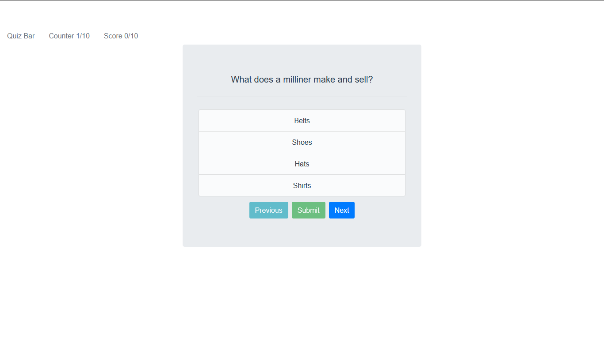

# quiz-vue
<h3>Single page Quiz Application using Vue js And Open Trivia Database  </h3>


<p align="center">
<h4>Home Page <sub>Select Option to Submit Answer</sub> </h4>

</p>
<p align="center">
<h4>Option selected </h4>

</p>

<p align="center">
<h4>Correct Answer</h4>

</p>

<p align="center">
<h4>Incorrect Answer</h4>

</p>

<p align="center">
<h4>Last Question Disable next Question</h4>

</p>

## Project setup
```
npm install
```

### Compiles and hot-reloads for development
```
npm run serve
```

### Compiles and minifies for production
```
npm run build
```

### Lints and fixes files
```
npm run lint
```

### Customize configuration
See [Configuration Reference](https://cli.vuejs.org/config/).
